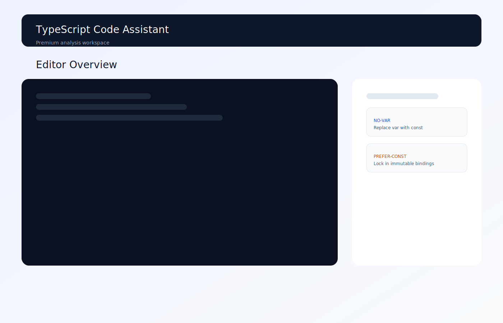
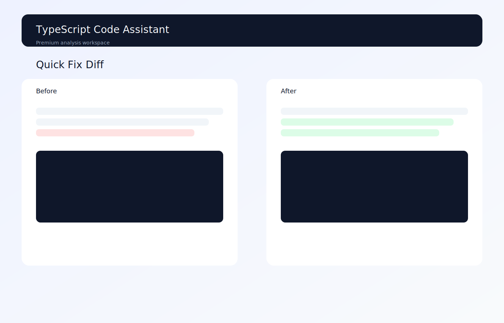
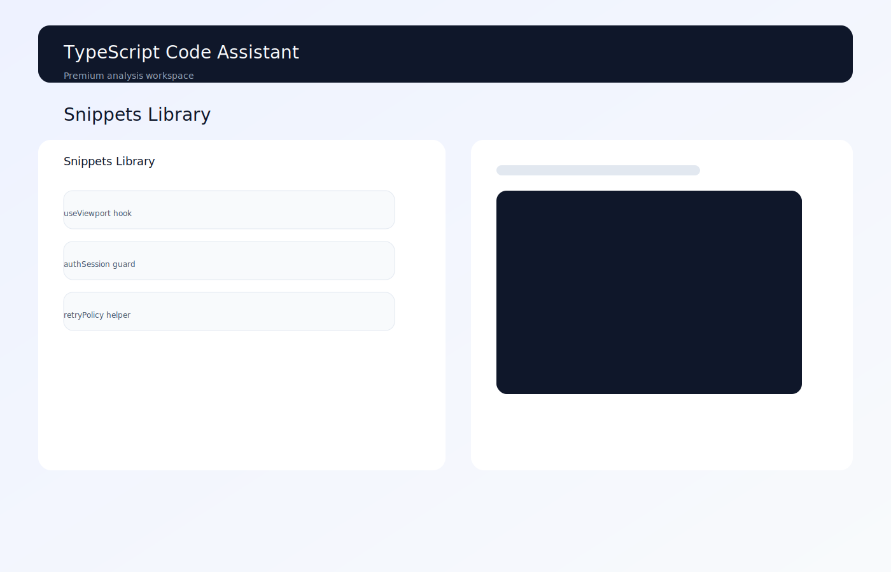
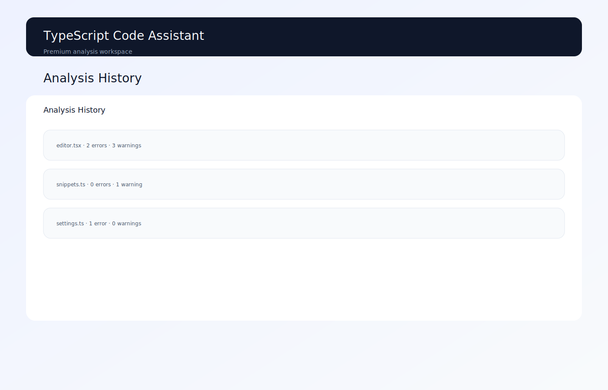

# TypeScript Code Assistant

**Ship-ready analysis workflows for TypeScript teams.**

TypeScript Code Assistant (TCA) is a full-stack workspace for running diagnostics, reviewing quick fixes, and tracking analysis history. It combines a polished frontend with a TypeScript-powered backend so you can analyze, format, and refactor code in minutes.

[](docs/screenshots/editor.svg)

## Why teams use TCA

- **Live diagnostics** via REST + WebSocket streaming.
- **Quick-fix previews** with before/after and inline diffs.
- **Snippet library** to save reusable TypeScript patterns.
- **Analysis history** for traceable run logs.
- **Light/dark theme** with accessible focus states.

## Demo in 60 seconds

```bash
npm install
npm run dev
```

Open the frontend at `http://localhost:5173` and the API at `http://localhost:5000/api`.

## UI previews (SVG)

> SVG previews are text-based and auto-generated via `npm run screenshots:svg`.






## Core workflows

1. **Editor** — run analysis, format code, and review quick fixes with inline diff previews.
2. **Snippets** — organize reusable patterns with search, metadata, and drawer actions.
3. **History** — monitor recent runs with severity summaries and detailed run modals.
4. **Settings** — toggle strict mode, WebSocket streaming, and rule sets.

## Scripts

| Command | Purpose |
| --- | --- |
| `npm run dev` | Run frontend + backend together |
| `npm run smoke` | Fast API smoke test |
| `npm run verify` | Full CI pipeline (lint, typecheck, test, e2e) |
| `npm run screenshots:svg` | Regenerate SVG previews |

## Architecture (high level)

```mermaid
graph TD
  UI --> Frontend (Vite + React) --> API[Backend (Node + Express)
  API --> Engine[Analysis Engine]
  Engine --> Shared[Shared Types]
```

## API quick summary

- REST base: `/api`
- WebSocket: `/api/stream`
- OpenAPI spec: `API.md`

See [`API.md`](API.md) for request/response schemas.

## Contributing

1. Fork the repo.
2. Create your feature branch: `git checkout -b feature/my-change`.
3. Run `npm run verify` before opening a PR.

Read [`CONTRIBUTING.md`](CONTRIBUTING.md) for guidelines.

## License

Licensed under the MIT License. See [`LICENSE`](LICENSE) if present in your fork.

## Quickstart (60 seconds)

```bash
npm install
npm run dev
```

## Demo

```bash
npm run build
node scripts/demo.mjs --demo
```

See [`docs/DEMO.md`](docs/DEMO.md) for full demo steps.

## Verification

```bash
scripts/verify.sh
```

See [`docs/VERIFICATION.md`](docs/VERIFICATION.md) and [`docs/BASELINE.md`](docs/BASELINE.md).

## Project structure

- `backend/` - Node.js HTTP API + WebSocket server
- `frontend/` - Vite + React UI
- `packages/analysis-engine/` - diagnostics + quick fixes
- `packages/sdk/` - client SDK helpers
- `shared/` - shared TypeScript types
- `docs/` - architecture, demo, security, and verification docs

## Design decisions

- Keep analysis engine pure and deterministic for offline testing.
- Use file-backed storage for simple local persistence.
- Keep optional observability features behind explicit environment flags.
- Observability options are documented in [`docs/OBSERVABILITY.md`](docs/OBSERVABILITY.md).
